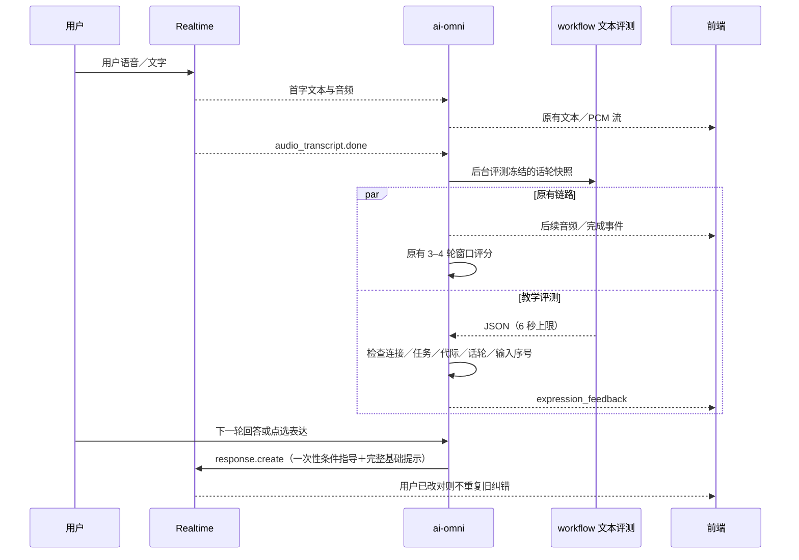

# Scene Theater 逐轮表达反馈

本次用户任务（2026-09-25）授权实现；用户进一步确认：**初学者或同类错误连续两次时，允许一句母语教学口播**。角色台词、示范句仍使用目标语。这一确认替代原验收第 7 条“母语仅反馈卡”的限制。

根目录六份 SDLC 工件属于既有 bootstrap 循环，未覆盖。未提交、合并或部署生产。预存 `docs/TODO.md` 和生产观察草稿不属于本次修改。

## 核查与文件清单

| 文件 | 核查／改动 |
| --- | --- |
| `services/ai-omni-service/app/prompt_manager.py` | Scene Theater 原提示要求至少两句、持续展开，缺少纠错锁定和示范表达；新增 correct/polish/advance 分支与正反例。保留原提示供开关关闭及排除模式使用。 |
| `services/ai-omni-service/app/main.py` | `_update_session_prompt` 的 Scene Theater 分支覆盖 OralTutor，其他分支模板不修改。transcript 完成事件启动独立异步反馈。下一次用户输入的 `response.create` 消费指导。 |
| `services/ai-omni-service/app/expression_feedback.py`（新增） | 冻结输入快照、独立 Redis 幂等键、任务／代际／话轮／输入序号检查、条件式单轮指导、连接清理。 |
| `services/workflow-service/src/workflows/expression_feedback.py`（新增） | 文本评测提示、严格字段验证、2–3 条第一人称表达、机器内容和常见 AI 口吻过滤；仅复用批量评测的 HTTP 客户端。 |
| `services/workflow-service/src/expression_routes.py`（新增）、`src/main.py` | 带内部密钥鉴权的独立接口及路由注册。 |
| `client/src/components/ExpressionFeedback.jsx`（新增） | 错误→修改→母语解释、表达按钮、可编辑用户回答、断线／发送失败／已发送状态。 |
| `client/src/pages/conversationExpressions.js`（新增）、`Conversation.js` | WS 去重、严格代际与场景检查、通过现有 text_message 发送用户文本、重置清理。 |
| `client/src/i18n/locales/*.json` | 按现有扁平键契约补齐九种语言（中英及其余七种），避免全量 i18n 检查失败。 |
| 两服务 `tests/test_expression_feedback.py`、前端 `__tests__/expression-feedback.test.js`、`e2e/expression-feedback.spec.js`（新增） | 离线协议、真实 callback 事件、异步竞态、组件及浏览器回归。 |
| `.env.example`、两份 Compose、`README.md`、本文 | 开关、入口说明、协议、限制和验证记录。 |

原 `_format_teaching_directive` 存在 correct/guide，但 `pending_directive` 无生产者，且只在音频上传协程中清除。新实现不依赖 COS 音频上传：指导放在单次 `response.create.instructions`，完整基础提示一并传入，响应结束后会话基础提示自然继续有效，不残留 session 级覆盖。

`batch_evaluation.py → _emit_scoring_result → proficiency_update → TaskProgressGuidance` 继续提供窗口级母语建议。批量评分、delta、完成阈值、代际重置与确认 API 未修改；本接口没有数据库连接或评分写入入口。示范表达发送后是正常用户输入，后续仍按现有 3–4 轮窗口评分，不因收到反馈直接加分。

## 提示词 before / after

Before（原文节选）：

```text
The student must produce a substantive, on-topic response of at least 2 sentences.
A one-liner or a vague answer does NOT qualify — ask for elaboration.
Just keep the conversation flowing and push the student to say MORE ...
Speak entirely in {target_language}.
```

After（实际新增规则节选）：

```text
CORRECTION FIRST — decide before speaking, every turn
CLEAR ERROR ... NO new question, NO elaboration request, NO advancement until corrected.
CORRECT BUT UNNATURAL ... affirm one concrete success ... Do not add a new question.
CORRECT AND NATURAL ... only ONE conversational step ... at most ONE new question.
If the new answer fixes the error, stop correcting the old answer.
```

同时保留 SCOPE LOCK、不猜测其他子任务、不宣布完成、人设和反注入要求；添加语法错误、完整点餐、足球跑题的正反例。示范内容不可让模型转移到点餐领域，实际当前子任务始终优先。初学者或连续同类错误允许一句母语解释，其余口播使用目标语。

Scene Theater 原提示完整保留在 `_generate_legacy_scene_theater_prompt`，便于审查和精确回滚。`magic_repetition`、`daily_qa`、`quick_experience`、`tour`、`recall` 均排除新逻辑；即使进入同名 phase 也保留旧提示。默认 `oral_tutor_template` 不在真实 Scene Theater phase 中使用，未做全局改写。

## 内部 HTTP 与 WebSocket 协议

`POST /internal/scene-expression-feedback` 只接受正确的 `X-Guaji-Internal-Auth`，密钥来自两服务已有 `INTERNAL_AUTH_SECRET`；密钥为空或不匹配返回 403。输入是当前场景、唯一当前子任务、语言、水平、本轮用户文本、上一条 AI 文本，不提供未来子任务或完整历史。HTTP 字段有长度限制。成功返回 `{success:true,data:...}`；超时、格式错误、模型异常或关闭时返回 `data:null`。

AI transcript 完成且有对应真实用户消息时，后台启动评测；不等待模型、不创建额外 AI 回复。模型结构化结果不写进会话文本、TTS、COS 或持久化聊天记录。现有音频 gate 与 marker 剥离保持不变。

WS 新事件示例（非评分事件）：

```json
{
  "type": "expression_feedback",
  "payload": {
    "turn_id": "stable-user-message-id",
    "goal_id": 7,
    "task_id": 42,
    "scoring_generation": 3,
    "scenario": "Restaurant",
    "teaching_mode": "correct",
    "errors": [{
      "original": "I want eat steak",
      "corrected": "I want to eat steak",
      "explanation_l1": "want 后接 to 加动词原形。"
    }],
    "alternatives": ["I'd like the steak, please.", "Could I have the steak?"],
    "next_question_locked": "",
    "off_topic": false,
    "repeat_error_count": 1,
    "allow_native_hint": true
  }
}
```

所有身份字段用于关联当前用户连接和任务；`scoring_generation` 必须存在，缺失不补 0。

- `correct`：有明确错误；`next_question_locked` 强制为空。`off_topic=true` 也锁定，不伪造语法错误。
- `polish`：正确但可优化；不给新问题。
- `advance`：只允许一个当前子任务内问题；无必要时可为空。
- `alternatives`：每次有效事件固定 2–3 条独立学生表达。常见服务员／导师口吻、标记、JSON、URL 拒收；支持现有九种语言的显式第一人称识别。不支持的语言静默跳过，不猜测。
- `repeat_error_count`：同一连接、同任务代际内连续相同纠错编辑签名的次数（例如 want eat steak／want drink water 都缺 to）；未变化的词不参与签名。这是保守的编辑模式识别，非通用语义错误分类器。重连后重新累计；Realtime 也可参考恢复历史判断重复错误。
- `allow_native_hint`：A0/A1/A2/Beginner 有错，或连续错误至少两次。最多一句母语教学解释；不改变角色台词语言。

前端正文使用 React 文本渲染，不渲染 HTML。按任务／代际／turn_id 去重，拒绝旧任务／旧代际／旧用户话轮事件。按钮通过 `{type:"text_message",payload:{text}}` 发出用户回答，填入卡片编辑框；旧卡和忙碌／断线时禁用。旧后端没有事件时不显示空卡，旧前端可忽略未知事件。

## 异步时序、边界与成本



**不可逆时序边界**：评测在本轮 AI transcript 完成之后才开始，不能追回已经播出的回复。因此“本轮纠错优先”由基础提示词要求，不能声称异步 JSON 能强制改变已播放音频。新一轮已开始时，迟到结果直接丢弃；不会强行打断或额外朗读一段纠错。下一轮已改对时，上一轮 directive 只作为条件背景，不能要求重复旧错误。

每个有效完成话轮最多一次额外文本调用。沿用 `BATCH_EVAL_MODEL`／`QWEN_TEXT_MODEL`、`QWEN_TEXT_BASE_URL` 及其官方 DashScope HTTPS 白名单和配套密钥，关闭 thinking。按典型短回答估算输入约 **1k–3k tokens**、输出 **200–600 tokens**；长输入可更高。这是估算，离线 stub 没有真实 usage 或费用。增量成本 = 输入 tokens × 模型输入单价 + 输出 tokens × 模型输出单价；不引用未经核实的实时价格。

首字音频路径没有新增 await；反馈自身等待最多约 6 秒模型时间，ai-omni HTTP 最多 7 秒。只有后台评测请求启动后的并行性经过离线阻塞测试，**未实测生产音频延迟或语义准确率**。

Redis `scene-expression:<sha256(user,goal,task,generation,scenario,turn)>` 使用 `SET NX EX 259200` 独立于评分锁。只存 claim，不存文本；原始稳定 turn_id 重放 72 小时内不重复调用或发卡。语义是 **at-most-once best effort**：先 claim 后请求，失败／断线可能少一张卡；没有 ACK／缓存重放，不宣称 exactly-once 送达。Redis 故障直接跳过；72 小时后不保证去重。断线取消任务，重连不会替换评分幂等信息。

## 开关与回滚

`SCENE_EXPRESSION_FEEDBACK_ENABLED=true` 默认启用。Compose 从根环境同时传给两服务；Zeabur 配置同名变量到两服务，并确保已有内部密钥一致。部署时先更新 workflow，再更新 ai-omni，最后 client。未更新 workflow 时 404 静默降级，语音与评分继续。

将两服务变量设为 `false` 并重新创建／发布服务后，新会话恢复原 Scene Theater 提示且不评测、不发卡、不使用待消费指导。浏览器无需回滚；已有反馈卡保持当前页面状态，刷新后消失。仅关闭 workflow 会停用评测，但 ai-omni 新基础提示仍在。

本地构建：`docker compose build ai-omni-service workflow-service`；前端必须 `npm --prefix client run build`。生产发布和合并仍由人工执行，本任务没有修改线上配置。

## 自动化验证与限制

基线（编辑前）：ai-omni 267 passed；workflow 126 passed。

本次 `npm run verify` 返回 **pass / 100**，其本地日志位于 `quality/artifacts/latest/`。最后两服务全量 pytest 结果：ai-omni **287 passed**、workflow **138 passed**；client **576 passed / 51 suites**，前端构建和 lint 通过（存在仓库既有 warnings）。独立场景 mock **25 passed**。

实际执行命令（两服务 pytest 分别运行，避免同名 `tests` 模块冲突）：

```sh
.venv/bin/python -m pytest services/ai-omni-service/tests -q
.venv/bin/python -m pytest services/workflow-service/tests -q
CI=true npm --prefix client test -- --watchAll=false --runInBand
npm --prefix client run lint
npm --prefix client run build
.venv/bin/python test_scenario_batch_and_daily_qa.py --scenario all --mock
npm run verify
npm --prefix client run test:e2e -- expression-feedback.spec.js --project=chromium-390 --project=chromium-desktop
python3 scripts/sdlc.py validate
git diff --check
```

Playwright **2 passed**（390×844、1440×900）：键盘点选发送、同轮去重、原分数保持、真实重置 REST 链路、旧代际丢弃；使用实际 PCM scheduler，验证新语音在 COS URL 前启动，同时丢弃旧 responseId 文本和 PCM。截图经人工查看，无横向溢出或卡片文字遮挡。截图：

- `quality/artifacts/playwright-results/expression-feedback-scene--062b2-erve-task-progress-critical-chromium-390/expression-feedback.png`
- `quality/artifacts/playwright-results/expression-feedback-scene--062b2-erve-task-progress-critical-chromium-desktop/expression-feedback.png`

独立只读复核按 `REVIEW.md` 检查 auth/scoring/WS/audio/data/UI，发现并修复“点选后 interruption 标志未复位导致新流式音频静音”的 P1；复核确认修复，未留已确认 high/critical。通用 UI skill 状态扫描未运行，使用针对真实组件和路由的上述测试覆盖空、禁用、失败、发送成功和键盘焦点状态。没有调用外部设计工具或上传截图。

最终 `docker compose build ai-omni-service workflow-service` **exit 0**；依赖安装与 `pip check` 完成后，再用缓存构建最终代码。两个最终镜像均通过 `docker run --rm --network none` 导入检查：workflow 的新内部路由已注册，ai-omni 的反馈模块可加载。未启动或重启现有服务，未访问真实 DashScope。`docker compose config --quiet`、SDLC validate、diff whitespace 检查均通过。

归档日志：`quality/artifacts/scene-expression-feedback/`，包括编辑前基线、最终两服务 pytest、前端测试/lint/build、场景 mock、Playwright、整体验证、最终 Docker build 与禁网导入记录。

验收覆盖映射：

| 用例 | 离线证据 |
| --- | --- |
| 1 语法错锁定 | workflow 校验强制清空新问题；want/to 样例；真实提示刷新→异步反馈→单轮 directive |
| 2 完整点餐 | advance/polish 解析、最多一个问题校验、提示正反例 |
| 3 足球跑题 | off_topic 强制 correct／空问题、directive 一句挡回契约 |
| 4 连错／母语例外 | 8 次连续输入、首轮高级无母语、第二轮起允许一句；初学者首轮允许 |
| 5 五轮学生表达 | 五组 2–3 条表达校验、常见 AI 口吻／非法标记拒收 |
| 6 八轮当前任务 | 非零代际、多次真实 prompt 刷新、同任务 scope、禁推进指导 |
| 7 语言分层 | 角色目标语＋经用户确认的一句母语例外提示契约 |
| 8 音频隔离／重连 | 真实 on_event 中模型挂起仍发 PCM／文本，独立反馈不进入音频字段；Redis 跨 callback 去重 |
| 9 前端 | chips 填入并发送一次、可编辑回答、断线与失败、缺事件降级；浏览器真实路由与 WS 适配器 mock |

这些测试使用离线 stub 验证提示契约、结构化结果校验、调度和 UI，**不能证明真实模型在任意五轮／八轮中的第一人称率、语用判断、语言纯度或话题准确率为 100%**。语义忠实度和自然语言问句数量仍有模型依从性边界；不为满足该断言调用真实 DashScope。
